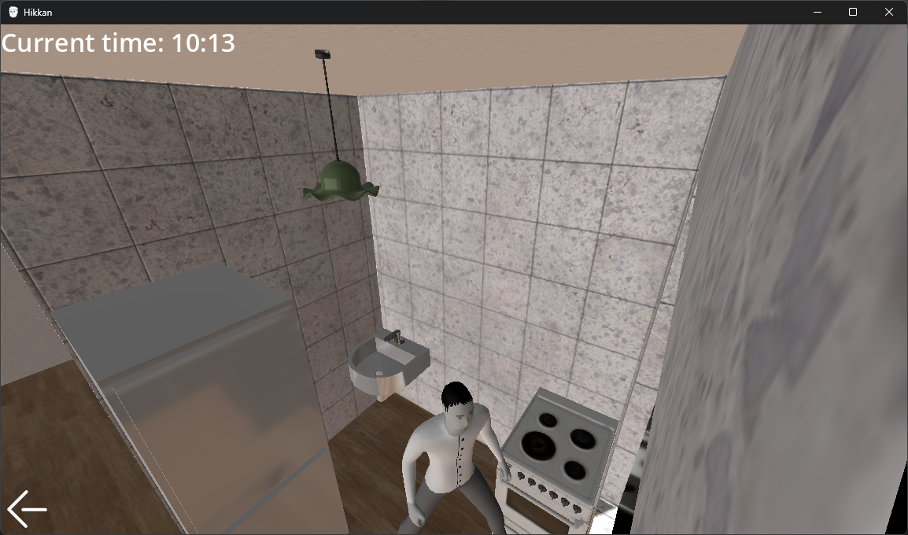
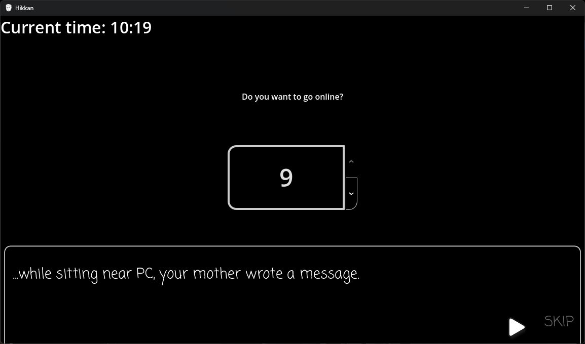
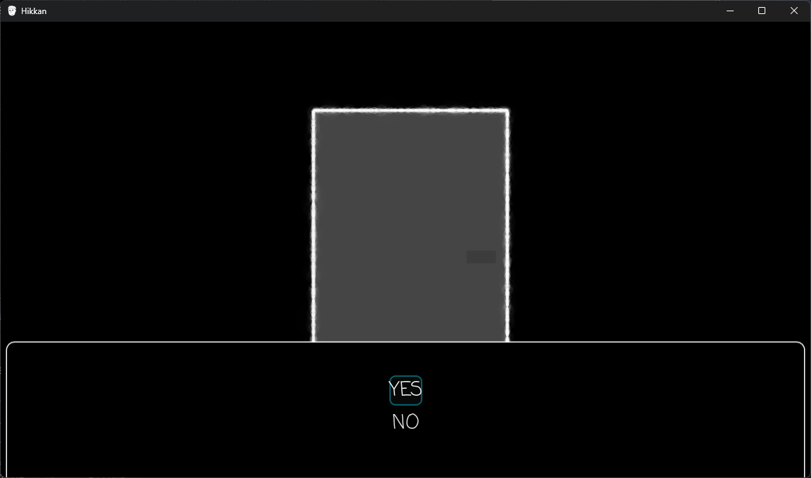

# Hikkan
## About
The game about hikkikomori, who decides to get out.

Could you overwhelm your fear?

Made in Godot (4.5.2-rc)

## License

Most of the code (except ./src/Scripts/Thirdparty, which is borrowed from Godot demos) is made by me and is licensed under [MIT License](./LICENSE.CODE).

./src/Assets/\*, except Assets/Materials/AmbientCG/* and Assets/ThirdPartyAssets/* are made by me and are licensed under [CC-BY 4.0](./LICENSE.OWN_ASSETS)

./src/addons/godot-visual-novel/Backgrounds/*.png is also made by me and licensed under [CC-BY 4.0](./LICENSE.OWN_ASSETS)